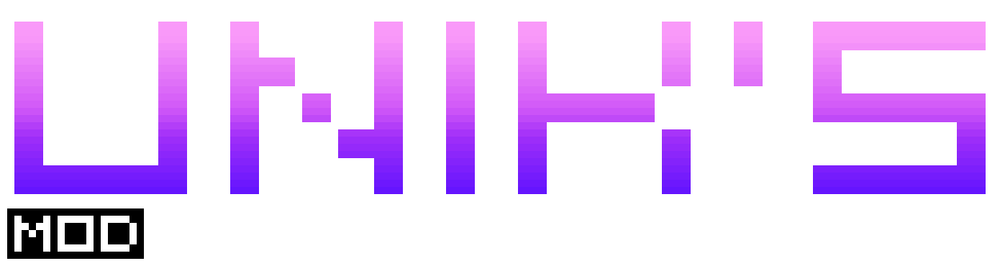
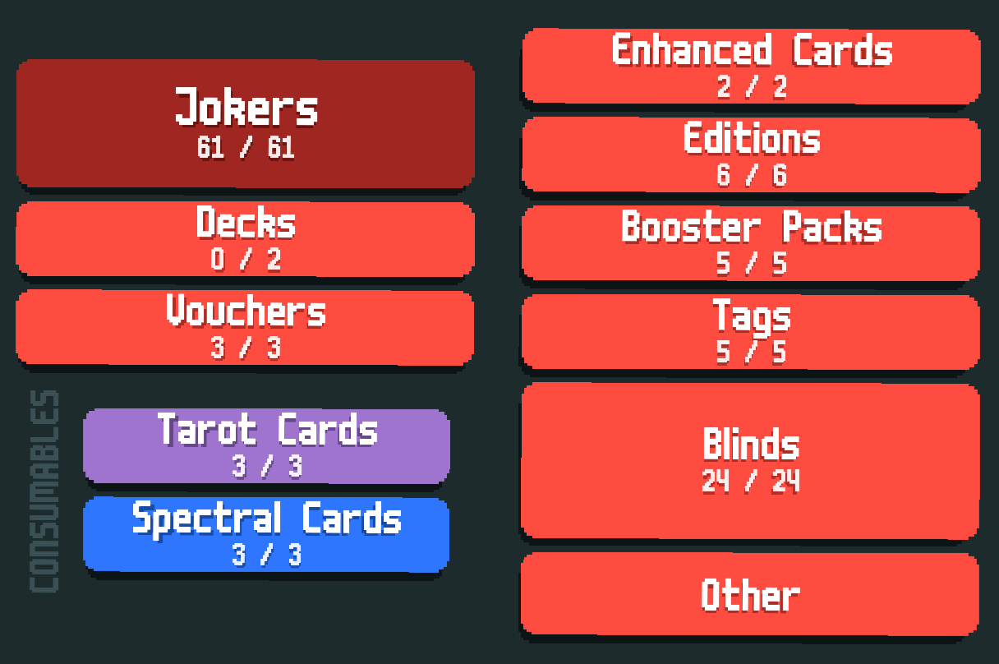

# UNIK's Mod!
A standalone mod that adds what I want. It is unbalanced compared to Vanilla though more tame compared with Cryptid.

Right now it is in a WIP stage of becoming a standalone, so expect placeholder art as well as potential bugs.

Requires Steamodded smods-1.0.0-beta-0827c or higher, Lovely v0.7.1 or higher. Talisman can be used to increase the scoring cap but isnt necessarily required.

## Features (so far)
- A total of 73 new Jokers are added in the base mod.
- - 12 **Common**
- - 17 **Uncommon** 
- - 22 **Rare**
- - 4 **Ancient**, an Exotic equivalent rarity featuring powerful Jokers.
- - 4 **Exotic**
- - 18 **Detrimental** (Basically Cursed Jokers)
- 3 **Tarots**
- 5 **Spectrals**
- 12 **Lartceps**, detrimental cards an Epic Blind forces you to choose.
- 5 **Poker Hands** from other mods:
- - *Bulwark*
- - *Spectrum*
- - *Straight Spectrum*
- - *Spectrum House*
- - *Spectrum Five*
- 6 **Stickers**, 2 of which are featured in Stakes
- 2 **Stakes:**
- - **Persimmon Stake** (Cards may be Triggering), comes after Orange Stake
- - **Shitty Stake** (Perishable Jokers may be disposable, Perishables self destruct instead of becoming debuffed), comes after Gold Stake
- - Oh and *Blue Stake* is modified.
- 7 **Tags**
- 7 **Editions**, 5 of which are purely detrimental.
- 3 **Enhancements**
- 3 Edition based **Decks**, one of which is inspired by a beta deck.
- 45 **Blinds**, 
- - 2 **"normal" blinds**
- - 12 **Finisher Blinds**
- - 12 **Regular Blinds**
- - 16 **Epic Blinds** and 4 **"Legendary" Blinds** (7 with Talisman), extremely cruel blinds that are designed to make sure you *suffer*.

This mod also contains many crossmod content such as for:
- Paperback
- Grab Bag
- Finity
- Cryptid, which includes balancing changes for some Cryptid Jokers, such as the infamous Canvas (Now legendary and nerfed) and Oil Lamp (Immutable and increases values by X1.2 onces)

------
While most of my artwork is done by me, art for the Spectrum-based Jokers and Planets are from Bunco and most of the code is mainly of my conception, although various ideas on Blinds, Characters and code are derived from others

### Credits
- Cryptid (Mod) - Bulwark + Asteroid Belt
- Kaeofthekae - Lily (character)
- Balatro goes Kino (Icyethics) - Inspiration for Epic Xenomorph Queen
- Aikoyori's Shennanigans (Aikoyori) - Inspiration for Epic Confrontation and Epic Height
- CelesteCardCollection (Mod) - Inspiration for Legendary Golden Crown
- Bunco (Mod) - Poker Hands Inspiration for Epic Sand and Epic Miser
- Ortalab (Shinku) - Inspiration for Epic Reed and Legendary Sword
- Paperback (PaperMoon) - Inspiration for Weetomancer
- MoreFluff (NotMario) - Color Cards
- Jen's Almanac (Jenwalter666) -  Epic/Legendary Blinds concept + some code used for functionality such as Blank Lartceps and shaders such as Dizzy and Bloated edition.
