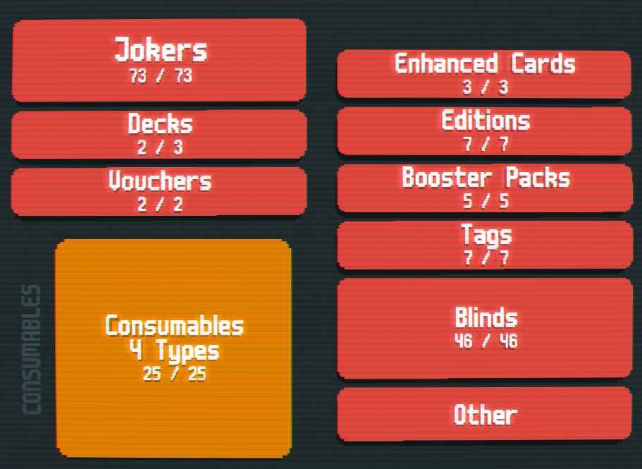
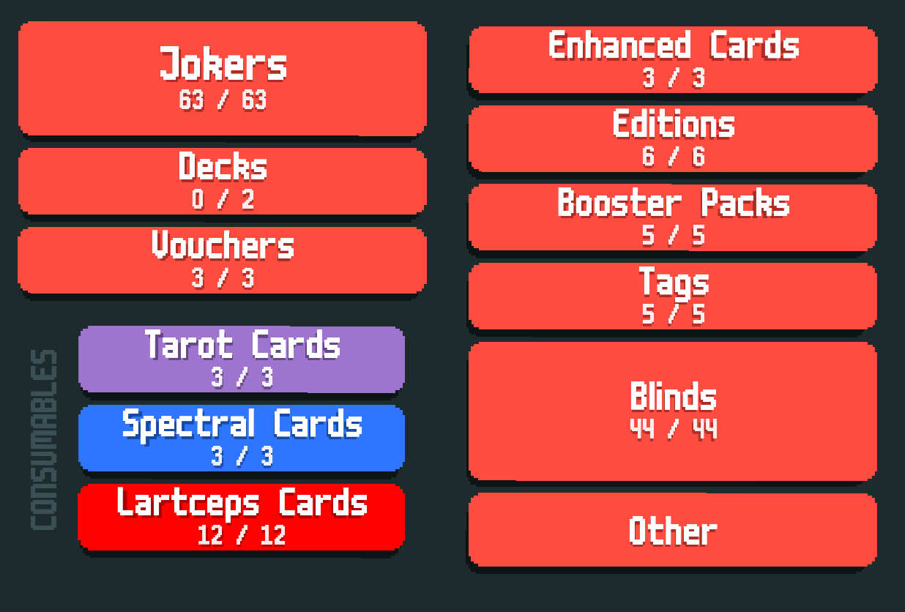

# UNIK's Mod!
An addon to Cryptid that adds a variety of features, some of which help and some of which are harmful.
This is mainly balanced around the Mainline gameset of Cryptid, and around various vanilla (or vanilla adjacent modded decks), where some challenge is provided.

Requires Steamodded smods-1.0.0-beta-0711a or higher, Lovely v0.7.1 and Cryptid v0.5.10~dev3 or higher.

## Features (so far)
- A total of 63 new Jokers are added, with 3 more fusions with a certain mod.
- - 7-9 **Common** (Depending on Crossmod)
- - 18-19 **Uncommon** (Depending on Crossmod)
- - 10 **Rare**
- - 10 **Epic** (Cryptid)
- - 4 **Exotic**
- - 16 **Cursed** (Detrimental Jokers from Cryptid)
- 3 **Tarots**
- 4 **Spectrals**
- If **Epic/Legendary Blinds** are enabled (or playing a certain mod), enables **Lartceps** with 12 consumables, detrimental cards an Epic Blind forces you to choose.
- 7 **Stickers**, 2 of which are featured in Stakes
- 2 **Stakes:**
- - **Persimmon Stake** (Cards may be Triggering), comes after Orange Stake
- - **Shitty Stake** (Jokers may be disposable), comes after Gold Stake
- 5 **Tags**
- 6 **Editions**, 5 of which are purely detrimental.
- 2 **Enhancements** (and "another" if **Epic/Legendary Blinds** are enabled)
- 2 Edition based **Decks**, one of which is inspired by a beta deck.
- 26 **Blinds**, 
- - 2 **"normal" blinds**
- - 12 **Finisher Blinds**
- - 13 **Regular Blinds**
- - 13 - 14 **Epic Blinds** and 7 **"Legendary" Blinds**, extremely cruel blinds that are designed to make sure you *suffer*.
- Mainline balancing changes for some Cryptid Jokers, such as the infamous Canvas (Now legendary) and Oil Lamp (Immutable and increases values by x1.075).

I'll focus on fixing some issues that may arise, adding more art and making more fusions and fusion art for that certain mod.
Due to the way it has been programmed, there may be some compatibility issues with other mods (although I have programmed some compatibility fixes for some mods)

------
Pretty much all artwork is done by me and most of the code is mainly of my conception, although various ideas on Blinds, Characters and code are derived from others

### Credits
- Kaeofthekae -  Lily (character)
- Balatro goes Kino (Icyethics) - Inspiration for Epic Xenomorph Queen and Darth Vader
- Aikoyori's Shennanigans (Aikoyori) - Inspiration for Epic Confrontation
- CelesteCardCollection (Mod) - Inspiration for Legendary Golden Crown
- Bunco (Mod) - Inspiration for Epic Sand
- Ortalab (Shinku) - Inspiration for Epic Reed and Legendary Sword
- Paperback (PaperMoon) - Inspiration for Weetomancer
- Jen's Almanac (Jenwalter666) -  Epic/Legendary Blinds concept + some code used for functionality such as Omegas and Blank Lartceps and shaders such as Dizzy and Bloated edition.
