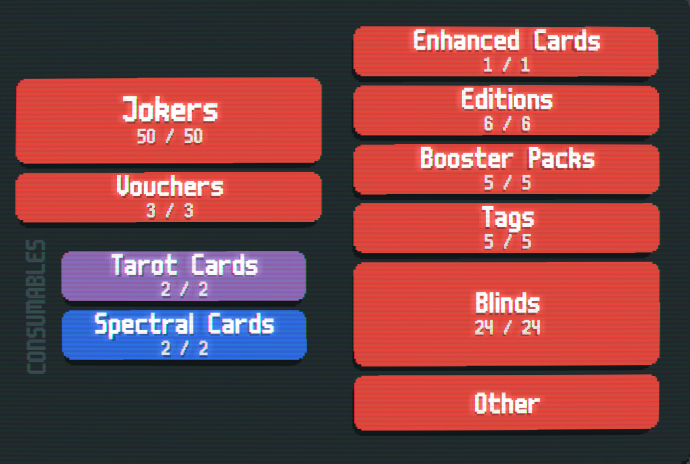
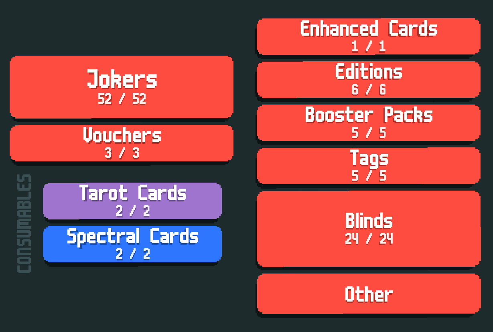

# UNIK's Mod!
An addon to Cryptid that adds a variety of features, some of which help and some of which are harmful.
This is mainly balanced around the Mainline gameset of Cryptid.

## Features (so far)
- A total of 51 new Jokers are added, with 3 more fusions with a certain mod.
- - 6 Common
- - 12 Uncommon
- - 5 Rare
- - 10 Epic
- - 4 Exotic
- - 16 Cursed
- 2 Tarots
- 2 Spectrals
- If Epic/Legendary Blinds are enabled (or playing a certain mod), enables Lartceps with 12 consumables, cards an Epic Blind forces you to choose.
- 7 Stickers, 2 of which are featured in 2 Stakes
- 2 Stakes:
- - Persimmon Stake (Cards may be Triggering), comes after Orange Stake
- - Shitty Stake (Jokers may be disposable), comes after Gold Stake
- 5 Tags
- 6 Editions, 5 of which are purely detrimental.
- 24 Blinds, 
- - 2 "normal" blinds
- - 10 Finisher Blinds
- - 12 Regular Blinds
- - If enabled (or playing a certain mod), 13 - 14 Epic Blinds and 7 "Legendary" Blinds, extremely cruel blinds that are designed to make sure 
- Mainline balancing changes for some Cryptid Jokers, such as the infamous Canvas (Now legendary) and Oil Lamp (Immutable and increases values by x1.075).

I'll focus on fixing some issues, adding more art and making more fusions and fusion art for that certain mod.
